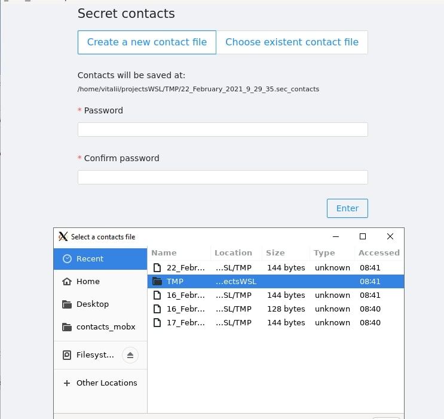
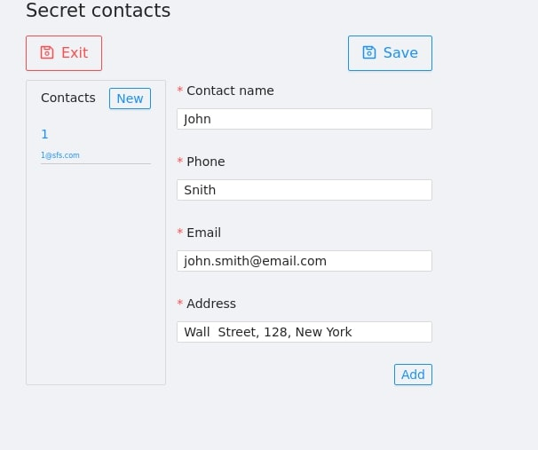
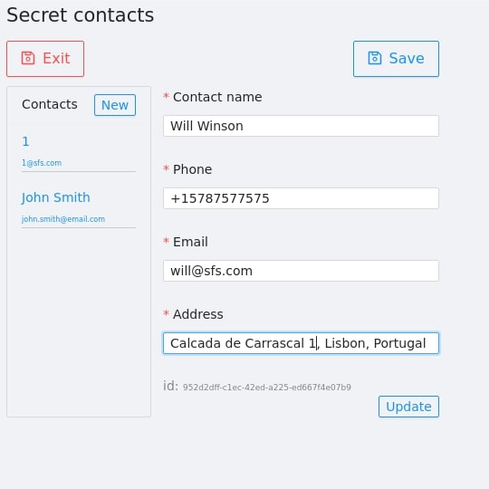
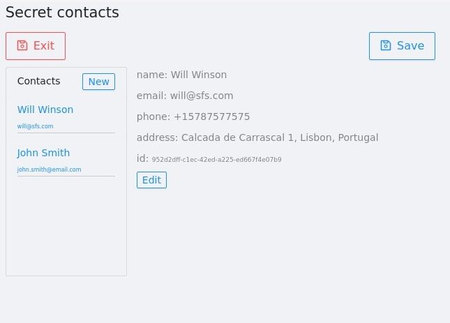
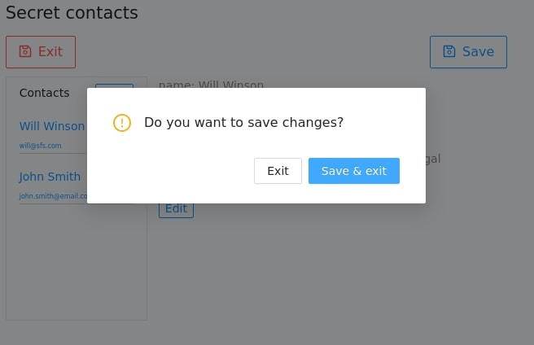

## Install
To tun the app run

```
  npm install 
  npm start
```

For building and packaging please check (electron-react-boilerplate docs)[https://electron-react-boilerplate.js.org/docs/packaging]


## User interface

- Create secret file 



- Create contact



- Edit contact



- Contacts list



- Save contacts


